# Backend Architecture - DGU POC App

**Dato:** 27. december 2025  
**Version:** 2.0  
**Firebase Project:** dgu-scorekort  
**Region:** europe-west1

---

## Table of Contents

1. [System Overview](#system-overview)
2. [Cloud Functions](#cloud-functions)
3. [Firestore Database](#firestore-database)
4. [External APIs](#external-apis)
5. [Authentication Flow](#authentication-flow)
6. [Data Synchronization](#data-synchronization)
7. [Security & Access Control](#security--access-control)
8. [Scheduled Jobs](#scheduled-jobs)

---

## System Overview

DGU POC App er en Flutter web/iOS app der integrerer med GolfBox OAuth, DGU APIs, og flere eksterne golf-relaterede data kilder. Backend består af Firebase Cloud Functions, Firestore database, og integrationer med DGU/Golfbox APIs.

### High-Level Architecture


### Komponenter

| Komponent | Teknologi | Formål |
|-----------|-----------|--------|
| **Flutter App** | Flutter 3.10.3 | Web & iOS client |
| **Cloud Functions** | Node.js (Firebase Gen 1 & 2) | Backend logic & CORS proxy |
| **Firestore** | NoSQL Database | Data persistence |
| **Firebase Hosting** | Static hosting | Web app deployment |
| **GitHub Gists** | Secret storage | API tokens (temporary solution) |

---

## Cloud Functions

Alle Cloud Functions kører i `europe-west1` region.

### 1. OAuth & Authentication

#### `golfboxCallback`
**Type:** HTTP Request  
**Trigger:** HTTPS onRequest  
**URL:** `https://europe-west1-dgu-scorekort.cloudfunctions.net/golfboxCallback`

**Formål:**  
OAuth callback dispatcher der fungerer som "blind relay" for GolfBox OAuth flow. Golfbox tillader kun ét redirect URI, så denne function router til correct destination baseret på state parameter.

**Input:**
- Query params: `code`, `state`

**Flow:**
1. Modtager OAuth callback fra Golfbox
2. Decoder `state` parameter (JSON eller legacy format)
3. Detekterer origin (`web`, `ios-app`)
4. Validerer target URL mod ALLOW_LIST
5. Redirecter til korrekt destination

**ALLOW_LIST (Security):**
```javascript
const ALLOW_LIST = [
  'http://localhost',
  'https://dgu-scorekort.web.app',
  'https://dgu-scorekort.firebaseapp.com',
  'https://dgu-app-poc.web.app',
  'https://dgu-app-poc.firebaseapp.com',
  'https://dgu-shortgame.web.app',
  'https://dgu-shortgame.firebaseapp.com'
];
```

**State Format:**
```json
{
  "verifier": "base64-encoded-pkce-verifier",
  "timestamp": 1735218000000,
  "origin": "ios-app"  // Optional: Only for iOS native app
}
```

**Output:**
- `302 Redirect` til:
  - Web: `https://dgu-app-poc.web.app/login?code=...&state=...`
  - iOS: `dgupoc://login?code=...&state=...`

---

#### `exchangeOAuthToken`
**Type:** Callable Function  
**Trigger:** HTTPS onCall  
**Timeout:** 30s  
**Memory:** 256MB

**Formål:**  
CORS proxy for token exchange. Exchangerer OAuth authorization code for access token via Golfbox Token API.

**Input:**
```json
{
  "code": "authorization_code_from_golfbox",
  "codeVerifier": "pkce_code_verifier"
}
```

**External API Call:**
- **Endpoint:** `https://auth.golfbox.io/connect/token`
- **Method:** POST
- **Body:** Form data med `grant_type`, `code`, `redirect_uri`, `client_id`, `code_verifier`

**Output:**
```json
{
  "success": true,
  "access_token": "bearer_token",
  "token_type": "Bearer",
  "expires_in": 3600,
  "scope": "get_player.information none union"
}
```

**Error Handling:**
- `invalid_grant` (400): Code already used eller expired
- Timeout (25s): Returns `deadline-exceeded` error

---

### 2. Course Cache System

#### `updateCourseCache`
**Type:** Scheduled Function  
**Trigger:** PubSub Schedule  
**Schedule:** `0 2 * * *` (02:00 CET daily)  
**Timeout:** 540s (9 min)  
**Memory:** 1GB

**Formål:**  
Nightly update af golf baner fra DGU API. Supporterer både full reseed og incremental updates.

**External API:**
- **Token:** Hentet fra GitHub Gist (`https://gist.githubusercontent.com/nhuttel/a907dd7d60bf417b584333dfd5fff74a/raw/.../dgu_token.txt`)
- **Clubs Endpoint:** `https://dgubasen.api.union.golfbox.io/DGUScorkortAapp/clubs`
- **Courses Endpoint:** `https://dgubasen.api.union.golfbox.io/DGUScorkortAapp/clubs/{clubId}/courses?active=1&sort=ActivationDate:1&sortTee=TotalLength:1&changedsince={date}`

**Update Strategy:**
- **Full Reseed:** Hvis `lastSeeded` > 30 dage eller null → clearer alt og reseeder
- **Incremental:** Hvis `lastSeeded` < 30 dage → fetcher kun ændringer siden sidste seed

**Course Filtering:**
- Kun aktive baner (`IsActive === true`)
- Aktiverings dato <= nu + 7 dage (HYBRID filtering for fremtidige baner)
- Kun seneste version per `TemplateID`

**Firestore Write:**
- **Collection:** `course-cache-clubs/{clubId}`
- **Document Structure:**
```json
{
  "info": { "ID": "123", "Name": "Club Name" },
  "courses": [ /* array of course objects */ ],
  "updatedAt": "Timestamp"
}
```
- **Metadata:** `course-cache-metadata/data`
```json
{
  "lastUpdated": "Timestamp",
  "lastSeeded": "Timestamp",
  "lastUpdateType": "full | incremental",
  "clubCount": 150,
  "courseCount": 450,
  "clubs": [ /* lightweight club list */ ],
  "version": 2
}
```

**Rate Limiting:** 300ms delay mellem API calls

---

#### `forceFullReseed`
**Type:** Callable Function  
**Trigger:** HTTPS onCall

**Formål:**  
Manuelt trigger full reseed ved næste scheduled run (02:00).

**Input:** None

**Output:**
```json
{
  "success": true,
  "message": "Full reseed scheduled for next run at 02:00"
}
```

---

### 3. Notifications

#### `sendNotification`
**Type:** Callable Function  
**Trigger:** HTTPS onCall  
**Timeout:** 30s

**Formål:**  
Sender push notifications via DGU notification service.

**Supported Types:**
1. **MARKER_APPROVAL:** Scorekort godkendelse
2. **FRIEND_REQUEST:** Venneanmodning

**Input (Friend Request):**
```json
{
  "type": "FRIEND_REQUEST",
  "toUnionId": "8-9997",
  "fromUserName": "Nick Huettel",
  "requestId": "abc123"
}
```

**External API:**
- **Token:** GitHub Gist (`https://gist.githubusercontent.com/nhuttel/ad197ae6de63e78d3d450fd70d604b7d/raw/.../gistfile1.txt`)
- **Endpoint:** `https://sendsinglenotification-d3higuw2ca-ey.a.run.app`
- **Method:** POST
- **Body:**
```json
{
  "data": {
    "recipients": ["8-9997"],
    "title": "Ny venneanmodning",
    "message": "Nick Huettel vil gerne være venner med dig...",
    "message_type": "DGUMessage",
    "message_link": "https://dgu-app-poc.web.app/friend-request/abc123",
    "expire_at": "2025-01-26T22:00:00",
    "token": "notification_token"
  }
}
```

---

#### `sendNotificationHttp`
**Type:** HTTP Request  
**Trigger:** HTTPS onRequest  
**CORS:** Enabled (`Access-Control-Allow-Origin: *`)

**Formål:**  
HTTP endpoint version af `sendNotification` for Flutter Web compatibility (callable functions har issues i production web builds).

**Usage:**
```bash
POST https://europe-west1-dgu-scorekort.cloudfunctions.net/sendNotificationHttp
Content-Type: application/json

{
  "type": "FRIEND_REQUEST",
  "toUnionId": "8-9997",
  "fromUserName": "Nick Huettel",
  "requestId": "abc123"
}
```

---

### 4. WHS Scores

#### `getWhsScores`
**Type:** Callable Function  
**Trigger:** HTTPS onCall  
**Timeout:** 30s  
**Memory:** 256MB

**Formål:**  
CORS proxy for at hente WHS scores fra DGU Statistik API.

**Input:**
```json
{
  "unionId": "177-2813",
  "limit": 20,
  "dateFrom": "20240101T000000",  // Optional
  "dateTo": "20251231T235959"     // Optional
}
```

**External API:**
- **Token:** GitHub Gist (`https://gist.githubusercontent.com/nhuttel/36871c0145d83c3111174b5c87542ee8/raw/.../statistik%20token`)
- **Format:** `basic [base64-credentials]`
- **Endpoint:** `https://api.danskgolfunion.dk/Statistik/GetWHSScores?UnionID={unionId}&RoundDateFrom={from}&RoundDateTo={to}`
- **Auth:** `Basic [credentials]`

**Output:**
```json
{
  "success": true,
  "scores": [ /* array of WHS score objects */ ],
  "count": 20
}
```

**Default Date Range:** Sidste 12 måneder

---

### 5. Activity Feed & Milestones

#### `scanForMilestones`
**Type:** Scheduled Function  
**Trigger:** PubSub Schedule  
**Schedule:** `0 3 * * *` (03:00 CET daily)  
**Timeout:** 540s (9 min)  
**Memory:** 1GB

**Formål:**  
Nightly scan for handicap milestones og nye scores for users med venner.

**Flow:**
1. Hent alle unique user IDs fra `friendships` collection
2. For hver user: Fetch fresh WHS scores
3. Sammenlign med cached scores → detect nye runder
4. Detect milestones:
   - **Scratch:** newHcp === 0.0
   - **Single Digit:** crossed 10.0 threshold
   - **Sub-20:** crossed 20.0 threshold
   - **Sub-30:** crossed 30.0 threshold
   - **Improvement:** ≥1.0 slag forbedring
   - **Personal Best:** New lowest HCP ever
   - **Eagle/Albatross:** Hole scores
5. Create activities i Firestore
6. Update `user_score_cache`

**External API:** (Same as `getWhsScores`)

**Firestore Write:**
- **Collection:** `activities`
- **Document Structure:**
```json
{
  "userId": "177-2813",
  "userName": "Nick Huettel",
  "type": "milestone",
  "timestamp": "2025-12-27T15:30:00Z",
  "data": {
    "milestoneType": "singleDigit",
    "newHcp": 9.8,
    "oldHcp": 10.2,
    "courseName": "Rungsted Golf"
  },
  "isDismissed": false,
  "createdAt": "Timestamp"
}
```

- **Collection:** `user_score_cache/{unionId}`
```json
{
  "unionId": "177-2813",
  "userName": "Nick Huettel",
  "homeClubId": "123",
  "currentHcp": 9.8,
  "bestHcp": 9.5,
  "lastScanned": "Timestamp",
  "recentScores": [ /* last 20 scores */ ],
  "updatedAt": "Timestamp"
}
```

---

### 6. Birdie Bonus Cache

#### `cacheBirdieBonusData`
**Type:** Scheduled Function  
**Trigger:** PubSub Schedule  
**Schedule:** `0 4 * * *` (04:00 CET daily)  
**Timeout:** 540s (9 min)  
**Memory:** 512MB

**Formål:**  
Cache Birdie Bonus participants data fra paginated API.

**External API:**
- **Token:** GitHub Gist (`https://gist.githubusercontent.com/nhuttel/10131112fc9ec097d1a0752d3569038e/raw/.../Birdie%20bonus%20deltagere`)
- **Endpoint:** `https://birdie.bonus.sdmdev.dk/api/member/rating_list/{page}`
- **Response:**
```json
{
  "data": [
    {
      "dguNumber": "177-2813",
      "BB participant": 2,  // Sequence number (not status!)
      "Birdiebonuspoints": 78,
      "rankInRegionGroup": 159,
      "rankInRegionGroupAndHcp": 41,
      "regionLabel": "Sjælland",
      "hcpGroupLabel": "0-10"
    }
  ],
  "next_page": 1  // null when done
}
```

**Pagination:** Starter på page 0, fortsætter indtil `next_page === null`

**Firestore Write:**
- **Collection:** `birdie_bonus_cache/{dguNumber}`
```json
{
  "dguNumber": "177-2813",
  "birdieCount": 78,
  "rankingPosition": 41,  // Primary ranking (region + HCP)
  "rankInRegion": 159,    // Backup ranking
  "regionLabel": "Sjælland",
  "hcpGroupLabel": "0-10",
  "isParticipant": true,  // Computed from BB participant > 0
  "updatedAt": "Timestamp"
}
```

**Field Name Handling:** API bruger `"BB participant"` (med space!) – koden checker multiple variations.

---

#### `testBirdieBonusAPI`
**Type:** Callable Function  
**Trigger:** HTTPS onCall

**Formål:**  
Debug function til at teste API response structure.

---

#### `manualCacheBirdieBonusData`
**Type:** Callable Function  
**Trigger:** HTTPS onCall  
**Timeout:** 540s

**Formål:**  
Manual trigger af cache update (fetcher kun første page for testing).

---

### 7. Tournaments & Rankings

#### `cacheTournamentsAndRankings`
**Type:** Scheduled Function  
**Trigger:** PubSub Schedule  
**Schedule:** `30 2 * * *` (02:30 CET daily)  
**Timeout:** 540s (9 min)  
**Memory:** 512MB

**Formål:**  
Cache tournaments og rankings fra Golf.dk Drupal API.

**External API:**
- **Token:** GitHub Gist (`https://gist.githubusercontent.com/nhuttel/3dce62aa15244a4aed2bfa50cd6e7099/raw/.../Turneringer%20og%20rangliste%20SD%20API`)
- **Tournaments:** `https://drupal.golf.dk/rest/taxonomy_lists/current_tournaments?_format=json`
- **Rankings:** `https://drupal.golf.dk/rest/taxonomy_lists/rankings?_format=json`
- **Icons:** `https://drupal.golf.dk/media/{iconId}/edit?_format=json`

**Firestore Write:**
- **Collection:** `tournaments_cache/current`
- **Collection:** `rankings_cache/current`
- **Collection:** `tournament_icons_cache/{iconId}`

**Icon Fetching:**
- Collect unique icon IDs fra tournaments + rankings
- Fetch hver icon URL fra Drupal Media API
- Rate limit: 100ms delay mellem requests

---

### 8. User Stats Triggers

#### `updateFriendStats`
**Type:** Firestore Trigger  
**Trigger:** `friendships/{friendshipId}` onCreate/onUpdate/onDelete

**Formål:**  
Auto-update user stats når friendships ændres.

**Updates:** `user_stats` for begge users i friendship

---

#### `updateChatGroupStats`
**Type:** Firestore Trigger  
**Trigger:** `chat_groups/{groupId}` onCreate/onUpdate/onDelete

**Formål:**  
Auto-update user stats når chat groups ændres.

**Updates:** `user_stats` for alle members

---

#### `updateMessageStats`
**Type:** Firestore Trigger  
**Trigger:** `messages/{groupId}/messages/{messageId}` onCreate/onUpdate

**Formål:**  
Auto-update unread counts når messages sendes/læses.

**Updates:** `user_stats.unreadChatCount` for group members

---

### 9. Chat Cleanup

#### `cleanupOldChatMessages`
**Type:** Scheduled Function  
**Trigger:** PubSub Schedule  
**Schedule:** `0 3 * * *` (03:00 CET daily)  
**Timeout:** 300s (5 min)  
**Memory:** 512MB

**Formål:**  
Slet chat messages ældre end 30 dage.

**Flow:**
1. Calculate cutoff date (now - 30 days)
2. For hver chat group:
   - Query messages med `timestamp < cutoff`
   - Delete i batches af 500 (Firestore limit)
3. Log total deleted

---

## Firestore Database

### Collections Overview

| Collection | Purpose | Write Access | Read Access |
|------------|---------|--------------|-------------|
| `course-cache-clubs` | Cached golf courses | Cloud Functions only | Public |
| `course-cache-metadata` | Course cache metadata | Cloud Functions only | Public |
| `scorecards` | Scorecard marker approval | Open (TEMP) | Open (TEMP) |
| `shortgame_rounds` | Short Game rounds | Owner only | Public |
| `friendships` | User friendships | Open (TEMP) | Open (TEMP) |
| `friend_requests` | Pending friend requests | Open (TEMP) | Open (TEMP) |
| `user_privacy_settings` | Privacy settings | Open (TEMP) | Open (TEMP) |
| `user_score_cache` | Cached WHS scores | Cloud Functions only | Authenticated |
| `activities` | Activity feed items | Cloud Functions only | Public (TEMP) |
| `birdie_bonus_cache` | Birdie Bonus data | Cloud Functions only | Public (TEMP) |
| `tournaments_cache` | Tournament data | Cloud Functions only | Public |
| `rankings_cache` | Rankings data | Cloud Functions only | Public |
| `tournament_icons_cache` | Tournament icons | Cloud Functions only | Public |
| `user_stats` | Aggregated user stats | Cloud Functions only | Public (TEMP) |
| `chat_groups` | Chat group metadata | Open (TEMP) | Open (TEMP) |
| `messages/{groupId}/messages` | Chat messages | Open (TEMP) | Open (TEMP) |

**TEMP:** Temporary open access for testing (vil blive strammet når OAuth er fully implemented)

---

### Collections Details

#### `course-cache-clubs/{clubId}`
**Purpose:** Cached golf course data (updated nightly)

**Document Structure:**
```json
{
  "info": {
    "ID": "123",
    "Name": "Rungsted Golf",
    "Address": "...",
    "City": "Rungsted Kyst"
  },
  "courses": [
    {
      "ID": "456",
      "Name": "Championship",
      "IsActive": true,
      "ActivationDate": "20250101T000000",
      "TemplateID": "template-123",
      "Tees": [ /* tee data */ ],
      "Holes": [ /* hole data */ ]
    }
  ],
  "updatedAt": "Timestamp"
}
```

---

#### `course-cache-metadata/data`
**Purpose:** Metadata for course cache system

**Document Structure:**
```json
{
  "lastUpdated": "Timestamp",
  "lastSeeded": "Timestamp",
  "lastUpdateType": "full | incremental",
  "clubCount": 150,
  "courseCount": 450,
  "clubsUpdatedLastRun": 10,
  "coursesUpdatedLastRun": 25,
  "clubs": [
    { "ID": "123", "Name": "Rungsted Golf" }
  ],
  "version": 2
}
```

---

#### `friendships/{friendshipId}`
**Purpose:** Active friendships mellem users

**Document ID:** Auto-generated

**Document Structure:**
```json
{
  "userId1": "177-2813",
  "userId2": "8-9997",
  "userName1": "Nick Huettel",
  "userName2": "Test User",
  "status": "active",
  "relationType": "friend | contact",
  "createdAt": "Timestamp",
  "acceptedAt": "Timestamp"
}
```

**Relation Types:**
- `friend`: Full friend (kan se handicap)
- `contact`: Chat contact (kan ikke se handicap)

---

#### `friend_requests/{requestId}`
**Purpose:** Pending friend requests

**Document ID:** Auto-generated

**Document Structure:**
```json
{
  "fromUserId": "177-2813",
  "fromUserName": "Nick Huettel",
  "toUserId": "8-9997",
  "requestedRelationType": "friend",
  "status": "pending | accepted | rejected | expired",
  "consentGiven": false,
  "consentTimestamp": null,
  "createdAt": "Timestamp",
  "expiresAt": "Timestamp (30 days)"
}
```

---

#### `user_privacy_settings/{unionId}`
**Purpose:** User privacy preferences

**Document ID:** Union ID (e.g., "177-2813")

**Document Structure:**
```json
{
  "unionId": "177-2813",
  "showHandicapToFriends": true,
  "allowFriendRequests": true,
  "allowedFriends": ["8-9997", "147-3270"],
  "updatedAt": "Timestamp"
}
```

---

#### `user_score_cache/{unionId}`
**Purpose:** Cached WHS scores for milestone detection

**Document ID:** Union ID

**Document Structure:**
```json
{
  "unionId": "177-2813",
  "userName": "Nick Huettel",
  "homeClubId": "123",
  "currentHcp": 9.8,
  "bestHcp": 9.5,
  "lastScanned": "Timestamp",
  "recentScores": [ /* last 20 WHS scores */ ],
  "updatedAt": "Timestamp"
}
```

---

#### `activities/{activityId}`
**Purpose:** Activity feed (milestones, improvements, etc.)

**Document ID:** Auto-generated

**Document Structure:**
```json
{
  "userId": "177-2813",
  "userName": "Nick Huettel",
  "type": "milestone | improvement | personalBest | eagle | albatross",
  "timestamp": "Timestamp (of achievement)",
  "data": {
    "milestoneType": "singleDigit | scratch | sub20 | sub30",
    "newHcp": 9.8,
    "oldHcp": 10.2,
    "courseName": "Rungsted Golf"
  },
  "isDismissed": false,
  "createdAt": "Timestamp (of creation)"
}
```

---

#### `birdie_bonus_cache/{dguNumber}`
**Purpose:** Cached Birdie Bonus participation data

**Document ID:** DGU Number (e.g., "177-2813")

**Document Structure:**
```json
{
  "dguNumber": "177-2813",
  "birdieCount": 78,
  "rankingPosition": 41,
  "rankInRegion": 159,
  "regionLabel": "Sjælland",
  "hcpGroupLabel": "0-10",
  "isParticipant": true,
  "updatedAt": "Timestamp"
}
```

---

#### `tournaments_cache/current`
**Purpose:** Current tournaments from Golf.dk

**Document Structure:**
```json
{
  "tournaments": [
    {
      "id": "123",
      "name": "DM for Hold",
      "icon": "6645",
      "url": "https://..."
    }
  ],
  "updatedAt": "Timestamp",
  "count": 15
}
```

---

#### `rankings_cache/current`
**Purpose:** Current rankings from Golf.dk

**Document Structure:** (Similar to tournaments)

---

#### `tournament_icons_cache/{iconId}`
**Purpose:** Cached tournament icon URLs

**Document ID:** Icon ID (e.g., "6645")

**Document Structure:**
```json
{
  "iconId": "6645",
  "url": "https://drupal.golf.dk/sites/default/files/...",
  "updatedAt": "Timestamp"
}
```

---

#### `user_stats/{unionId}`
**Purpose:** Aggregated user statistics

**Document ID:** Union ID

**Document Structure:**
```json
{
  "unionId": "177-2813",
  "totalFriends": 15,
  "fullFriends": 10,
  "contacts": 5,
  "unreadChatCount": 3,
  "totalChatGroups": 4,
  "lastUpdated": "Timestamp"
}
```

**Updated By:** Firestore triggers (`updateFriendStats`, `updateChatGroupStats`, `updateMessageStats`)

---

#### `chat_groups/{groupId}`
**Purpose:** Chat group metadata

**Document ID:** Auto-generated

**Document Structure:**
```json
{
  "name": "Rungsted Golf Venner",
  "members": ["177-2813", "8-9997", "147-3270"],
  "createdBy": "177-2813",
  "createdAt": "Timestamp",
  "lastMessage": "Hej alle sammen!",
  "lastMessageTime": "Timestamp",
  "unreadCount": {
    "177-2813": 0,
    "8-9997": 2,
    "147-3270": 1
  },
  "hiddenFor": []
}
```

---

#### `messages/{groupId}/messages/{messageId}`
**Purpose:** Chat messages (subcollection)

**Document ID:** Auto-generated

**Document Structure:**
```json
{
  "senderId": "177-2813",
  "senderName": "Nick Huettel",
  "text": "Hej alle sammen!",
  "timestamp": "Timestamp"
}
```

**Auto-Deletion:** Messages older than 30 days deleted by `cleanupOldChatMessages`

---

#### `scorecards/{scorecardId}`
**Purpose:** Scorecard marker approval flow

**Document ID:** Auto-generated

**Document Structure:**
```json
{
  "playerId": "177-2813",
  "playerName": "Nick Huettel",
  "markerId": "8-9997",
  "markerName": "Test User",
  "clubId": "123",
  "courseId": "456",
  "courseName": "Championship",
  "holes": [ /* hole scores */ ],
  "totalScore": 85,
  "status": "pending | approved | rejected",
  "createdAt": "Timestamp",
  "approvalUrl": "https://dgu-app-poc.web.app/marker-approval/abc123"
}
```

---

## External APIs

### 1. Golfbox OAuth & API

#### OAuth Endpoints

**Base URL:** `https://auth.golfbox.io`

| Endpoint | Method | Purpose |
|----------|--------|---------|
| `/connect/authorize` | GET | OAuth authorization (user login) |
| `/connect/token` | POST | Token exchange (PKCE flow) |

**Client ID:** `DGU_TEST_DK`  
**Scope:** `get_player.information none union`  
**Flow:** OAuth 2.0 PKCE (Proof Key for Code Exchange)

**Authorization URL:**
```
https://auth.golfbox.io/connect/authorize
  ?client_id=DGU_TEST_DK
  &redirect_uri=https://europe-west1-dgu-scorekort.cloudfunctions.net/golfboxCallback
  &response_type=code
  &scope=get_player.information%20none%20union
  &code_challenge=BASE64URL(SHA256(code_verifier))
  &code_challenge_method=S256
  &country_iso_code=dk
  &state=BASE64URL(JSON({verifier, timestamp, origin?}))
```

**Token Exchange:**
```http
POST https://auth.golfbox.io/connect/token
Content-Type: application/x-www-form-urlencoded

grant_type=authorization_code
&code=AUTH_CODE
&redirect_uri=https://europe-west1-dgu-scorekort.cloudfunctions.net/golfboxCallback
&client_id=DGU_TEST_DK
&code_verifier=CODE_VERIFIER
```

**Response:**
```json
{
  "access_token": "eyJhbGciOiJSUzI1NiIsInR5cCI6IkpXVCJ9...",
  "token_type": "Bearer",
  "expires_in": 3600,
  "scope": "get_player.information none union"
}
```

---

#### DGU API (Courses)

**Base URL:** `https://dgubasen.api.union.golfbox.io/DGUScorkortAapp`

**Authentication:** Basic Auth (token fra GitHub Gist)  
**Gist URL:** `https://gist.githubusercontent.com/nhuttel/a907dd7d60bf417b584333dfd5fff74a/raw/.../dgu_token.txt`

| Endpoint | Method | Purpose |
|----------|--------|---------|
| `/clubs` | GET | Fetch all clubs |
| `/clubs/{clubId}/courses` | GET | Fetch courses for club |

**Courses Query Params:**
- `active=1`: Only active courses
- `sort=ActivationDate:1`: Sort by activation date
- `sortTee=TotalLength:1`: Sort tees by length
- `changedsince=20250301T000000`: Only courses changed since date

**Used By:** `updateCourseCache` (nightly at 02:00)

---

### 2. DGU Statistik API (WHS Scores)

**Base URL:** `https://api.danskgolfunion.dk/Statistik`

**Authentication:** Basic Auth (token fra GitHub Gist)  
**Gist URL:** `https://gist.githubusercontent.com/nhuttel/36871c0145d83c3111174b5c87542ee8/raw/.../statistik%20token`  
**Format:** `basic [base64-credentials]`

| Endpoint | Method | Purpose |
|----------|--------|---------|
| `/GetWHSScores` | GET | Fetch WHS scores for player |

**Query Params:**
- `UnionID`: Player's union ID (e.g., "177-2813")
- `RoundDateFrom`: Start date (format: `20240101T000000`)
- `RoundDateTo`: End date (format: `20251231T235959`)

**Response:** Array of WHS score objects

**Used By:**
- `getWhsScores` (callable function)
- `scanForMilestones` (nightly at 03:00)

---

### 3. Birdie Bonus API

**Base URL:** `https://birdie.bonus.sdmdev.dk/api/member`

**Authentication:** Basic Auth (token fra GitHub Gist)  
**Gist URL:** `https://gist.githubusercontent.com/nhuttel/10131112fc9ec097d1a0752d3569038e/raw/.../Birdie%20bonus%20deltagere`

| Endpoint | Method | Purpose |
|----------|--------|---------|
| `/rating_list/{page}` | GET | Fetch participants (paginated) |

**Response:**
```json
{
  "data": [ /* participants */ ],
  "next_page": 1  // null when done
}
```

**Pagination:** Start at page 0, continue until `next_page === null`

**Used By:** `cacheBirdieBonusData` (nightly at 04:00)

---

### 4. Golf.dk API (Tournaments & Rankings)

**Base URL:** `https://drupal.golf.dk`

**Authentication:** Token från GitHub Gist  
**Gist URL:** `https://gist.githubusercontent.com/nhuttel/3dce62aa15244a4aed2bfa50cd6e7099/raw/.../Turneringer%20og%20rangliste%20SD%20API`

| Endpoint | Method | Purpose |
|----------|--------|---------|
| `/rest/taxonomy_lists/current_tournaments?_format=json` | GET | Fetch current tournaments |
| `/rest/taxonomy_lists/rankings?_format=json` | GET | Fetch rankings |
| `/media/{iconId}/edit?_format=json` | GET | Fetch icon metadata |

**Used By:** `cacheTournamentsAndRankings` (nightly at 02:30)

---

### 5. DGU Notification Service

**Base URL:** `https://sendsinglenotification-d3higuw2ca-ey.a.run.app`

**Authentication:** Token in request body (fra GitHub Gist)  
**Gist URL:** `https://gist.githubusercontent.com/nhuttel/ad197ae6de63e78d3d450fd70d604b7d/raw/.../gistfile1.txt`

**Method:** POST

**Request Body:**
```json
{
  "data": {
    "recipients": ["177-2813"],
    "title": "Notification Title",
    "message": "Notification message text",
    "message_type": "DGUMessage",
    "message_link": "https://...",
    "expire_at": "2025-12-31T23:59:59",
    "token": "NOTIFICATION_TOKEN"
  }
}
```

**Used By:**
- `sendNotification` (callable)
- `sendNotificationHttp` (HTTP)

---

## API Credentials Reference

> **SECURITY NOTE:** This section references credential storage locations but does NOT include actual tokens.  
> All tokens are stored in private GitHub Gists. Never commit actual tokens to this repository.

### Credentials Overview

| API / Service | Account/Username | Endpoints | Auth Type | Gist Identifier | Token Format | Owner |
|---------------|------------------|-----------|-----------|-----------------|--------------|-------|
| **DGU API** | `DGUScorkortAapp` | `/clubs`<br/>`/clubs/{id}/courses`<br/>`/golfer?unionid={id}` | Basic Auth | `a907dd7d60bf...` | `basic [token]` | nhuttel |
| **Statistik API** | `Statistik` | `/GetWHSScores` | Basic Auth | `36871c0145d8...` | `basic [base64]` | nhuttel |
| **Birdie Bonus API** | `member` | `/api/member/rating_list/{page}` | Basic Auth | `10131112fc9e...` | `Basic [credentials]` | nhuttel |
| **Notification Service** | N/A (Cloud Run) | POST body `token` field | Token | `ad197ae6de63...` | Plain text token | nhuttel |
| **Golf.dk / Tournaments** | N/A (Drupal) | `/rest/taxonomy_lists/*`<br/>`/media/{id}/edit` | Authorization header | `3dce62aa1524...` | Token string | nhuttel |
| **Golfbox OAuth** | `DGU_TEST_DK` | `/connect/authorize`<br/>`/connect/token` | OAuth 2.0 PKCE | N/A (public) | Client ID: `DGU_TEST_DK` | Public |

### API Account Grouping

**DGU API (samme Basic Auth konto):**
- `/clubs` - Henter alle golf klubber i DGU
- `/clubs/{clubId}/courses` - Henter baner for specifik klub
- `/golfer?unionid={unionId}` - Henter spiller info (navn, handicap, homeClubId)

**Statistik API (separat konto):**
- `/GetWHSScores` - WHS scores fra anden API base URL (`api.danskgolfunion.dk`)

**Birdie Bonus API (separat konto):**
- `/api/member/rating_list/{page}` - Paginated ranking data

**Golf.dk API (separat konto):**
- Turnerings- og ranglistedata fra Drupal CMS

### How to Access Credentials

1. **Storage:** All tokens stored in private GitHub Gists owned by `nhuttel`
2. **Gist ID:** First 16 chars shown in table (e.g., `a907dd7d60bf...`)
3. **Full URL Pattern:** 
   ```
   https://gist.githubusercontent.com/nhuttel/{FULL_GIST_ID}/raw/{REVISION_ID}/{FILENAME}
   ```
4. **Finding Full URLs:** Search in [`functions/index.js`](../functions/index.js) for complete Gist URLs
5. **Token Rotation:** Simply update Gist content (URLs remain same, content changes)

### Security Notes

- ✅ **Gist IDs are safe to share** - Raw content URLs include unique revision IDs
- ✅ **Easy rotation** - Update Gist content without changing code
- ⚠️ **Gists are PRIVATE** - Never share raw URLs publicly (contains tokens)
- ⚠️ **Temporary solution** - GitHub Gists er ikke optimal secret management
- 🔐 **Future migration** - Plan er at flytte til Firebase Secret Manager eller Google Cloud Secret Manager

### Migration Plan

**Current State:** GitHub Gists (quick setup, temporary)

**Future State:** Firebase/Google Cloud Secret Manager
- ✅ Better security & access control
- ✅ Automatic audit logging
- ✅ Rotation support med versioning
- ✅ IAM integration for fine-grained permissions
- ✅ No external dependencies

**Migration Steps:**
1. Create secrets in Firebase Secret Manager
2. Update Cloud Functions to use Secret Manager API
3. Test thoroughly i staging
4. Deploy to production
5. Delete/deactivate Gists

---

## Authentication Flow

### OAuth 2.0 PKCE Flow Diagram

```mermaid
sequenceDiagram
    participant User
    participant App as Flutter App
    participant CloudFn as Cloud Function<br/>golfboxCallback
    participant GolfboxAuth as Golfbox OAuth<br/>auth.golfbox.io
    participant TokenFn as Cloud Function<br/>exchangeOAuthToken
    participant GolfboxToken as Golfbox Token API
    participant Firestore
    
    User->>App: Click "Login med Golfbox"
    App->>App: Generate code_verifier
    App->>App: Generate code_challenge = SHA256(verifier)
    App->>App: Encode state = base64({verifier, timestamp, origin?})
    
    App->>GolfboxAuth: Redirect to /connect/authorize<br/>with challenge + state
    GolfboxAuth->>User: Show login form
    User->>GolfboxAuth: Enter credentials
    
    GolfboxAuth->>CloudFn: 302 Redirect with code + state
    CloudFn->>CloudFn: Decode state → get target URL
    CloudFn->>CloudFn: Validate target against ALLOW_LIST
    
    alt iOS Native App
        CloudFn->>App: 302 to dgupoc://login?code=...
    else Web App
        CloudFn->>App: 302 to https://dgu-app-poc.web.app/login?code=...
    end
    
    App->>App: Extract code from URL
    App->>App: Decode state → get verifier
    
    App->>TokenFn: Call with code + verifier
    TokenFn->>GolfboxToken: POST /connect/token<br/>grant_type=authorization_code
    GolfboxToken-->>TokenFn: {access_token, expires_in}
    TokenFn-->>App: {success: true, access_token}
    
    App->>App: Store access_token
    App->>GolfboxAuth: GET user info with Bearer token
    GolfboxAuth-->>App: {unionId, name, ...}
    
    App->>Firestore: Read/Write user data
    Firestore-->>App: Data synced
    
    App->>User: Show Dashboard
```



### Key Security Features

1. **PKCE (Proof Key for Code Exchange):**
   - Code verifier generated in app (random 64 chars)
   - Code challenge = SHA256(verifier) sent to OAuth
   - Verifier sent during token exchange
   - Prevents authorization code interception

2. **State Parameter:**
   - Contains code verifier (for web compatibility)
   - Contains timestamp (for debugging)
   - Contains origin (for platform detection)
   - Base64url encoded JSON

3. **ALLOW_LIST Validation:**
   - Cloud Function validates redirect URL
   - Prevents open redirect attacks
   - Only pre-approved domains allowed

4. **CORS Proxy:**
   - Token exchange via Cloud Function
   - Avoids CORS issues in browser
   - No client-side secrets

---

## Data Synchronization

### Real-Time Updates Flow


### Cache Update Schedule

| Time | Function | Purpose | Duration |
|------|----------|---------|----------|
| 02:00 | `updateCourseCache` | Golf courses | ~9 min |
| 02:30 | `cacheTournamentsAndRankings` | Tournaments | ~5 min |
| 03:00 | `scanForMilestones` | User scores & milestones | ~9 min |
| 03:00 | `cleanupOldChatMessages` | Delete old messages | ~5 min |
| 04:00 | `cacheBirdieBonusData` | Birdie Bonus data | ~9 min |

**Total nightly processing:** ~30-40 minutes

---

## Security & Access Control

### Firestore Security Rules Summary

| Collection | Read | Write | Notes |
|------------|------|-------|-------|
| `course-cache-*` | ✅ Public | ❌ Only CF | Cached data |
| `birdie_bonus_cache` | ✅ Public (TEMP) | ❌ Only CF | Should be authenticated |
| `tournaments_cache` | ✅ Public | ❌ Only CF | Public data |
| `user_score_cache` | ✅ Authenticated | ❌ Only CF | Requires OAuth |
| `user_stats` | ✅ Public (TEMP) | ❌ Only CF | Should be authenticated |
| `activities` | ✅ Public (TEMP) | ❌ Only CF | Should be authenticated |
| `friendships` | ✅ Open (TEMP) | ✅ Open (TEMP) | Testing only |
| `friend_requests` | ✅ Open (TEMP) | ✅ Open (TEMP) | Testing only |
| `chat_groups` | ✅ Open (TEMP) | ✅ Open (TEMP) | Testing only |
| `messages/*` | ✅ Open (TEMP) | ✅ Open (TEMP) | Testing only |
| `scorecards` | ✅ Open (TEMP) | ✅ Open (TEMP) | Testing only |

**CF = Cloud Functions (Admin SDK)**

### Security TODOs

1. **Implement Firebase Auth Custom Claims:**
   - Add `unionId` to JWT token
   - Enable proper user-level access control

2. **Tighten Firestore Rules:**
   - Friends: Only read/write own friendships
   - Chat: Only members can read/write
   - Privacy: Only owner can modify settings
   - Stats: Only authenticated users

3. **Move API Tokens to Secret Manager:**
   - Replace GitHub Gists with proper secrets
   - Use Firebase Secret Manager or Google Secret Manager

---

## Scheduled Jobs

### Complete Schedule

```mermaid
gantt
    title Nightly Cloud Functions Schedule (CET)
    dateFormat HH:mm
    axisFormat %H:%M
    
    section Cache Updates
    Course Cache           :02:00, 9m
    Tournaments            :02:30, 5m
    
    section User Data
    Milestone Scan         :03:00, 9m
    Chat Cleanup           :03:00, 5m
    
    section External APIs
    Birdie Bonus           :04:00, 9m
```



### Job Dependencies


### Resource Usage

| Function | Memory | Timeout | Typical Duration |
|----------|--------|---------|------------------|
| `updateCourseCache` | 1GB | 540s | 5-8 min |
| `scanForMilestones` | 1GB | 540s | 3-7 min |
| `cacheBirdieBonusData` | 512MB | 540s | 2-5 min |
| `cacheTournamentsAndRankings` | 512MB | 540s | 2-4 min |
| `cleanupOldChatMessages` | 512MB | 300s | 1-3 min |

---

## Quick Reference

### Cloud Function URLs

```bash
# OAuth Callback
https://europe-west1-dgu-scorekort.cloudfunctions.net/golfboxCallback

# Token Exchange (Callable)
https://europe-west1-dgu-scorekort.cloudfunctions.net/exchangeOAuthToken

# WHS Scores (Callable)
https://europe-west1-dgu-scorekort.cloudfunctions.net/getWhsScores

# Notifications (HTTP)
https://europe-west1-dgu-scorekort.cloudfunctions.net/sendNotificationHttp

# Notifications (Callable)
https://europe-west1-dgu-scorekort.cloudfunctions.net/sendNotification

# Manual Cache Triggers
https://europe-west1-dgu-scorekort.cloudfunctions.net/forceFullReseed
https://europe-west1-dgu-scorekort.cloudfunctions.net/manualCacheBirdieBonusData
https://europe-west1-dgu-scorekort.cloudfunctions.net/testBirdieBonusAPI
```

### Useful Commands

```bash
# Deploy all functions
firebase deploy --only functions

# Deploy specific function
firebase deploy --only functions:updateCourseCache

# View logs
firebase functions:log

# View specific function logs
firebase functions:log --only updateCourseCache

# Test callable function (requires Firebase CLI auth)
firebase functions:shell
> getWhsScores({unionId: "177-2813", limit: 20})
```

### Monitoring

**Firebase Console:**
- Functions: https://console.firebase.google.com/project/dgu-scorekort/functions
- Firestore: https://console.firebase.google.com/project/dgu-scorekort/firestore
- Hosting: https://console.firebase.google.com/project/dgu-scorekort/hosting

**Live URLs:**
- POC App: https://dgu-app-poc.web.app
- Alt Domain: https://dgu-scorekort.web.app

---

## Related Documentation

- [IOS_OAUTH_LOGIN_LOOP_ISSUE.md](./IOS_OAUTH_LOGIN_LOOP_ISSUE.md) - iOS OAuth deep link issue
- [IOS_MIGRATION_LESSONS_LEARNED.md](./IOS_MIGRATION_LESSONS_LEARNED.md) - iOS migration guide
- [IOS_PLATFORM_SUPPORT_GUIDE.md](./IOS_PLATFORM_SUPPORT_GUIDE.md) - Platform-specific code patterns

---

**Document Version:** 1.0  
**Last Updated:** 27. december 2025  
**Maintained By:** Development Team

