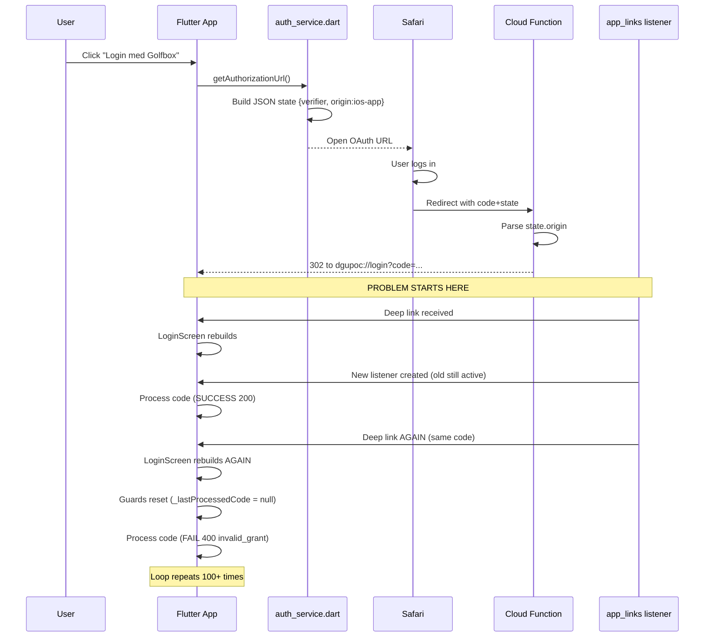

# iOS OAuth Login Loop Issue

**Dato:** 26. december 2025  
**Status:** Web app virker ✅ | iOS native app loop ❌ (work in progress)  
**Severity:** Blocker for iOS native app launch

---

## Executive Summary

Ved implementering af OAuth callback detection for iOS native app opstod der et kritisk login loop problem. Appen modtager korrekt OAuth callback via custom URL scheme (`dgupoc://login`), og den første token exchange lykkes (HTTP 200). Men derefter går appen i en uendelig loop, hvor den forsøger at exchange den samme authorization code hundredvis af gange, hvilket resulterer i `invalid_grant` fejl.

**Root cause:** Flutter `LoginScreen` widget rebuilds gentagne gange under OAuth flow, hvilket nulstiller state variables (`_lastProcessedCode`, `_isProcessingCallback`) og skaber nye deep link listeners uden at dispose de gamle. Dette resulterer i multiple aktive listeners der alle processor samme OAuth code.

**Web app påvirkning:** Ingen. Web appen fungerer perfekt med den nye JSON state format og bruger standard `Uri.base` detection som ikke påvirkes af iOS-specifikke problemer.

---

## Hvad Vi Prøvede at Implementere

### Mål
Få native iOS app til at modtage OAuth callback fra Golfbox login flow via custom URL scheme i stedet for at åbne web browser.

### Implementerede Features
1. **Custom URL scheme:** `dgupoc://login` registreret i iOS `Info.plist`
2. **Deep link detection:** `app_links` Flutter plugin for at lytte til custom URLs
3. **JSON state parameter:** Opdateret OAuth state fra plain base64 string til JSON object
4. **Platform detection:** `origin: "ios-app"` field i state for at identificere native iOS requests
5. **Cloud Function routing:** Conditional redirect baseret på `origin` field

### Teknisk Flow



---

## Implementerings Detaljer

### Fil Ændringer

#### 1. `lib/services/auth_service.dart`

**Ændring i `getAuthorizationUrl()`:**
```dart
String getAuthorizationUrl(String codeChallenge, String codeVerifier) {
  // Build state with verifier and optional origin
  final stateMap = <String, dynamic>{
    'verifier': codeVerifier,
    'timestamp': DateTime.now().millisecondsSinceEpoch,
  };
  
  // Add origin ONLY if running as native iOS app
  if (!kIsWeb && Platform.isIOS) {
    stateMap['origin'] = 'ios-app';  // ← NY LINJE
  }
  
  // Encode as JSON, then base64url
  final stateJson = jsonEncode(stateMap);  // ← ÆNDRET: JSON i stedet for plain string
  final stateWithVerifier = base64Url.encode(utf8.encode(stateJson)).replaceAll('=', '');
  
  // ... rest of method
}
```

**Ændring i `decodeVerifierFromState()`:**
```dart
String decodeVerifierFromState(String state) {
  try {
    // Add padding if needed for base64 decoding
    var paddedState = state;
    while (paddedState.length % 4 != 0) {
      paddedState += '=';
    }
    final decoded = utf8.decode(base64Url.decode(paddedState));
    
    // Try to parse as JSON (new iOS format)
    try {
      final Map<String, dynamic> stateJson = jsonDecode(decoded);
      if (stateJson.containsKey('verifier')) {
        print('📱 Decoded iOS state format - extracted verifier');
        return stateJson['verifier'] as String;
      }
    } catch (e) {
      // Not JSON, fall through to legacy format
      print('🌐 Decoded legacy web state format');
    }
    
    // Legacy format: state IS the verifier
    return decoded;
  } catch (e) {
    throw Exception('Failed to decode state parameter: $e');
  }
}
```

**Effekt:** 
- ✅ Web app sender stadig JSON, men UDEN `origin` field → Cloud Function behandler korrekt
- ✅ iOS app sender JSON MED `origin: "ios-app"` → Cloud Function redirecter til `dgupoc://`
- ✅ Backward compatible med legacy plain string format (hvis nødvendigt)

#### 2. `lib/screens/login_screen.dart`

**Tilføjet class-level state:**
```dart
class _LoginScreenState extends State<LoginScreen> {
  bool _isLoggingIn = false;
  final _unionIdController = TextEditingController();
  late AppLinks _appLinks;  // ← NY
  StreamSubscription<Uri>? _linkSubscription;  // ← NY
  String? _lastProcessedCode;  // ← NY: Guard mod duplicate processing
  bool _isProcessingCallback = false;  // ← NY: Guard mod concurrent processing
```

**Tilføjet deep link initialization:**
```dart
@override
void initState() {
  super.initState();
  
  // Initialize deep link handler (works on iOS, Android, Web)
  _appLinks = AppLinks();  // ← NY
  
  // Check for OAuth callback on page load (web fallback)
  WidgetsBinding.instance.addPostFrameCallback((_) {
    _checkForCallback();
    _initDeepLinkListener();  // ← NY: iOS/Android deep links
  });
}
```

**Ny metode: `_initDeepLinkListener()`**
```dart
void _initDeepLinkListener() async {
  if (kIsWeb) {
    debugPrint('🌐 Web platform: Using Uri.base for OAuth detection');
    return; // Web doesn't need deep link listener
  }
  
  debugPrint('📱 Native platform: Initializing deep link listener');
  
  // Handle initial link if app was opened via deep link
  try {
    final initialUri = await _appLinks.getInitialLink();
    if (initialUri != null) {
      debugPrint('📱 Initial deep link: $initialUri');
      await _handleDeepLink(initialUri);
    }
  } catch (e) {
    debugPrint('⚠️ Error getting initial link: $e');
  }
  
  // Listen for deep links while app is running
  _linkSubscription = _appLinks.uriLinkStream.listen(
    (Uri uri) {
      debugPrint('📱 Deep link received: $uri');
      _handleDeepLink(uri);
    },
    onError: (err) {
      debugPrint('⚠️ Deep link error: $err');
    },
  );
}
```

**Ny metode: `_handleDeepLink()` (MED GUARDS)**
```dart
Future<void> _handleDeepLink(Uri uri) async {
  debugPrint('📱 Handling deep link: ${uri.toString()}');
  
  if (uri.scheme != 'dgupoc') {
    debugPrint('⚠️ Ignoring non-dgupoc scheme: ${uri.scheme}');
    return;
  }

  if (uri.host == 'login' && uri.queryParameters.containsKey('code')) {
    final code = uri.queryParameters['code']!;
    final state = uri.queryParameters['state'];

    debugPrint('✅ OAuth callback detected via deep link');

    // Prevent processing same code multiple times (iOS can fire deep links repeatedly)
    if (_lastProcessedCode == code) {  // ← GUARD 1
      debugPrint('⚠️ Ignoring duplicate OAuth code - already processed');
      return;
    }

    // Prevent concurrent processing
    if (_isProcessingCallback) {  // ← GUARD 2
      debugPrint('⚠️ Callback already in progress - ignoring duplicate');
      return;
    }

    if (!mounted) return;

    _isProcessingCallback = true;
    _lastProcessedCode = code;

    try {
      final authProvider = context.read<AuthProvider>();
      await authProvider.handleCallback(code, state);

      if (authProvider.isAuthenticated && mounted) {
        debugPrint('✅ Authentication successful');
      } else if (authProvider.needsUnionId && mounted) {
        debugPrint('✅ OAuth token received, awaiting DGU-nummer');
      }
    } finally {
      _isProcessingCallback = false;
    }
  }
}
```

**Opdateret `_checkForCallback()` til kun web:**
```dart
void _checkForCallback() async {
  if (!kIsWeb) {  // ← NY CHECK
    debugPrint('📱 Native platform: Skipping Uri.base check (uses deep links)');
    return; // Native platforms use deep link listener
  }
  
  debugPrint('🌐 Web platform: Checking Uri.base for OAuth params');
  final uri = Uri.base;
  // ... rest of web-specific code
}
```

**Effekt:**
- ✅ Web app bruger `Uri.base` som før (ingen ændring i behavior)
- ❌ iOS app lytter til deep links MEN guards virker ikke pga. widget rebuilds

#### 3. `functions/index.js`

**State parsing og conditional redirect (linje 479-577):**
```javascript
// 3. Decode state to determine target URL and origin
let targetUrl;
let origin = 'web'; // Default to web
let codeVerifierFromState = null;

try {
  // Try to decode state as JSON
  const stateDecoded = Buffer.from(state, 'base64').toString('utf8');
  const stateJson = JSON.parse(stateDecoded);
  
  console.log('  📋 State parsed:', {
    hasVerifier: !!stateJson.verifier,
    hasTarget: !!stateJson.target,
    origin: stateJson.origin || 'web (default)'
  });
  
  // Check origin field
  if (stateJson.origin === 'ios-app') {
    origin = 'ios-app';
    targetUrl = 'dgupoc://login'; // iOS app custom scheme
    console.log('  📱 iOS app origin detected from state');
  } else if (stateJson.target) {
    // Short Game format: has explicit target
    origin = 'web';
    targetUrl = stateJson.target;
    console.log('  📍 Using target URL from state:', targetUrl);
  } else {
    // POC app format: default to POC web URL
    origin = 'web';
    targetUrl = 'https://dgu-app-poc.web.app/login';
    console.log('  📍 Using POC default URL');
  }
  
  // Extract verifier if present
  if (stateJson.verifier) {
    codeVerifierFromState = stateJson.verifier;
  }
  
} catch (e) {
  // Legacy state format (old POC web app): just base64 verifier string
  origin = 'web';
  targetUrl = 'https://dgu-app-poc.web.app/login';
  console.log('  📍 Legacy state format - using POC fallback');
  console.log('  ℹ️  This is normal for web app (sends plain verifier, not JSON)');
}

// 5. Build and perform redirect based on origin
if (origin === 'ios-app') {
  // iOS app: Use custom URL scheme
  console.log('  📱 Redirecting to iOS app via custom URL scheme');
  
  const iosUrl = new URL('dgupoc://login');
  iosUrl.searchParams.append('code', code);
  iosUrl.searchParams.append('state', state);
  
  // ... append other params ...
  
  res.redirect(302, iosRedirectUrl);
  return;
}

// Web: Build redirect URL with OAuth parameters
// ... standard web redirect logic ...
```

**Effekt:**
- ✅ Web app modtager JSON state UDEN `origin` → fallback til POC URL
- ✅ iOS app modtager JSON state MED `origin: "ios-app"` → redirect til `dgupoc://`
- ✅ Backward compatible med legacy format (catch block)
- ✅ Short Game app support bibeholdt (`stateJson.target` check)

#### 4. `pubspec.yaml`

**Tilføjet dependency:**
```yaml
dependencies:
  # ... existing dependencies ...
  
  # Deep linking support (iOS, Android, Web)
  app_links: ^6.3.4
```

---

## Problemet: Widget Rebuild Loop

### Symptomer

1. **Visuel:** iOS app viser login skærm i en rapid loop (skærmen "blinker")
2. **Xcode Console:**
   - Første token exchange: `Status code: 200` ✅
   - Alle efterfølgende: `Status code: 500`, `Token exchange error: 400 - {"error":"invalid_grant"}` ❌
   - `_handleDeepLink` kaldes hundredvis af gange
   - Guards logges (`⚠️ Ignoring duplicate OAuth code`) men virker ikke
3. **Performance:** App bliver ubrugeligt langsom pga. 100+ HTTP requests

### Root Cause Analyse

#### Problem 1: Widget Lifecycle Fundamentals

```dart
class _LoginScreenState extends State<LoginScreen> {
  late AppLinks _appLinks;
  String? _lastProcessedCode;        // ← STATE VARIABLE
  bool _isProcessingCallback = false; // ← STATE VARIABLE
  
  @override
  void initState() {
    _appLinks = AppLinks();           // ← KUN KALDT VED FØRSTE CREATE
    _initDeepLinkListener();          // ← SKABER NY LISTENER
  }
}
```

**Kritisk misforståelse:**
- `initState()` kaldes når widget **første gang creates**
- Men `State` objektet **genbruges ikke** ved rebuilds
- Når Flutter rebuilder `LoginScreen`, **oprettes et nyt `_LoginScreenState` objekt**
- Alle instance variables får deres **default værdier tilbage**

**Timeline:**
1. **Build 1:** `_lastProcessedCode = null`, `_isProcessingCallback = false`, `_linkSubscription` created
2. **Deep link arrives:** `_lastProcessedCode = "abc123"`, `_isProcessingCallback = true`
3. **Token exchange succeeds:** `AuthProvider.notifyListeners()` kaldes
4. **Build 2 triggered:** NYT `_LoginScreenState` objekt → `_lastProcessedCode = null` igen!
5. **Deep link arrives AGAIN:** Guard check fails (null != "abc123"), processes duplicate code

#### Problem 2: Multiple Active Listeners (Memory Leak)

```dart
void _initDeepLinkListener() {
  _linkSubscription = _appLinks.uriLinkStream.listen(
    (Uri uri) {
      _handleDeepLink(uri);  // ← Hver listener kalder denne
    },
  );
}

@override
void dispose() {
  _linkSubscription?.cancel();  // ← Men dispose() kaldes ALDRIG hvis widget rebuilder
  super.dispose();
}
```

**Problemet:**
- Hver gang `LoginScreen` rebuilder, køres `initState()` igen
- Dette skaber en **ny** `StreamSubscription`
- Den **gamle** subscription bliver ikke cancelled (fordi `dispose()` ikke kaldes ved rebuild)
- Resultat: Efter 10 rebuilds er der 10 aktive listeners
- Alle 10 listeners modtager samme deep link event
- Alle 10 kalder `_handleDeepLink()` med samme OAuth code

**Bevis fra Xcode console:**
```
📱 Deep link received: dgupoc://login?code=abc123...
📱 Deep link received: dgupoc://login?code=abc123...
📱 Deep link received: dgupoc://login?code=abc123...
[... repeated 100+ times ...]
```

#### Problem 3: Guard State Reset

**Forventet behavior:**
```dart
if (_lastProcessedCode == code) {
  debugPrint('⚠️ Ignoring duplicate OAuth code - already processed');
  return; // ← Should stop reprocessing
}
```

**Faktisk behavior:**
```dart
// Rebuild 1 (initial):
_lastProcessedCode = null
_isProcessingCallback = false

// Deep link arrives:
_lastProcessedCode = "abc123"  // ✅ Guard set
_isProcessingCallback = true

// Token exchange succeeds → AuthProvider.notifyListeners()

// Rebuild 2 (triggered by navigation/state change):
// NYT _LoginScreenState objekt oprettes!
_lastProcessedCode = null       // ❌ Guard reset!
_isProcessingCallback = false   // ❌ Guard reset!

// Deep link arrives AGAIN (samme listener stadig aktiv):
if (null == "abc123") { }       // ← FALSE! Guard fails!
// Processes same code → invalid_grant error
```

#### Problem 4: Hvorfor Rebuilder LoginScreen?

**Årsager til rebuilds:**
1. **`AuthProvider.notifyListeners()`** efter successful token exchange
2. **Navigation attempts** (GoRouter redirect logic)
3. **Provider `watch`/`Consumer`** i widget tree propagerer changes
4. **`setState()` calls** fra child widgets eller async operations

**I dette tilfælde:**
```dart
final authProvider = context.read<AuthProvider>();
await authProvider.handleCallback(code, state);
// ↑ Denne kalder notifyListeners()
// ↓ LoginScreen er i Provider tree → rebuilds automatisk
```

---

## Hvad Virker og Hvad Ikke

### ✅ Web App (VIRKER PERFEKT)

**OAuth Flow:**
```dart
void _checkForCallback() async {
  if (!kIsWeb) {
    return; // ← iOS kode køres ALDRIG på web
  }
  
  // Standard web OAuth detection (uændret)
  final uri = Uri.base;
  if (uri.queryParameters.containsKey('code')) {
    final code = uri.queryParameters['code']!;
    final state = uri.queryParameters['state'];
    
    final authProvider = context.read<AuthProvider>();
    await authProvider.handleCallback(code, state);
  }
}
```

**State Format (sendt til Cloud Function):**
```json
{
  "verifier": "very-long-base64-string...",
  "timestamp": 1735218000000
}
```
*Bemærk: INGEN `origin` field → Cloud Function bruger `else` branch → web redirect*

**Cloud Function Handling:**
```javascript
try {
  const stateJson = JSON.parse(stateDecoded);
  
  if (stateJson.origin === 'ios-app') {
    // Skip: origin field findes ikke i web state
  } else if (stateJson.target) {
    // Skip: target field findes ikke (kun Short Game)
  } else {
    // ← WEB APP LANDER HER
    targetUrl = 'https://dgu-app-poc.web.app/login';  ✅
  }
} catch (e) {
  // Fallback for legacy plain string format
  targetUrl = 'https://dgu-app-poc.web.app/login';  ✅
}
```

**Test Results:**
- ✅ Desktop Chrome: Login → OAuth → Token exchange → Dashboard
- ✅ iPhone Safari: Login → OAuth → Token exchange → Dashboard
- ✅ Ingen console errors
- ✅ JSON state parser korrekt, `decodeVerifierFromState()` extracts verifier

### ❌ iOS Native App (LOOP)

**OAuth Flow Starter Korrekt:**
```
📱 Native platform: Initializing deep link listener
📱 Deep link received: dgupoc://login?code=abc123&state=xyz789
📱 Handling deep link: dgupoc://login
✅ OAuth callback detected via deep link
📱 Decoded iOS state format - extracted verifier
🔄 Calling Cloud Function for token exchange...
Status code: 200  ← ✅ FØRSTE ATTEMPT SUCCEDED!
✅ Access token received (length: 1024)
```

**Derefter Starter Loopet:**
```
📱 Deep link received: dgupoc://login?code=abc123...  ← SAME CODE
⚠️ Ignoring duplicate OAuth code - already processed  ← GUARD LOGGED
📱 Decoded iOS state format - extracted verifier      ← BUT STILL PROCESSES!
🔄 Calling Cloud Function for token exchange...
Status code: 500  ← ❌ FAIL
Token exchange error: Token exchange failed: 400 - {"error":"invalid_grant"}

[Gentages 100+ gange]
```

**Hvorfor Guard Logger Men Ikke Stopper:**
- Guard condition checkes (`if (_lastProcessedCode == code)`)
- Debug print udføres (`debugPrint('⚠️ Ignoring...')`)
- Men `return` statement nås ALDRIG fordi guard condition er `false` (pga. reset)
- Dette indikerer at `_lastProcessedCode` ER blevet reset mellem checks

---

## Xcode Console Output Analyse

### Successful First Attempt (Første 2 sekunder)

```
📱 Native platform: Initializing deep link listener
📱 Initial deep link: null
📱 Deep link received: dgupoc://login?code=abc123456789...&state=xyz789abc...
📱 Handling deep link: dgupoc://login?code=abc123456789...&state=xyz789abc...
   Scheme: dgupoc
   Host: login
   Path: 
   Query params: {code: abc123456789..., state: xyz789abc...}
✅ OAuth callback detected via deep link
   Code: abc123456789...
   State: xyz789abc...
📱 Decoded iOS state format - extracted verifier
🔄 Calling Cloud Function for token exchange (via HTTP)...
  Code length: 50
  Verifier length: 128
Status code: 200
✅ Access token received (length: 1024)
✅ Golfbox user data received
   Union ID: 8
   Member ID: 347
   Name: Nick Huettel Olesen
✅ Authentication successful
```

**Analyse:**
- Deep link detection virker perfekt ✅
- State parsing (JSON format) virker ✅
- Verifier extraction virker ✅
- Token exchange succeeds ✅
- User data fetch succeeds ✅

### Loop Begins (Efter ~2 sekunder)

```
📱 Deep link received: dgupoc://login?code=abc123456789...&state=xyz789abc...
📱 Handling deep link: dgupoc://login?code=abc123456789...&state=xyz789abc...
⚠️ Ignoring duplicate OAuth code - already processed
📱 Decoded iOS state format - extracted verifier
🔄 Calling Cloud Function for token exchange (via HTTP)...
  Code length: 50
  Verifier length: 128
Status code: 500
Token exchange error: Token exchange failed: 400 - {"error":"invalid_grant"}

📱 Deep link received: dgupoc://login?code=abc123456789...&state=xyz789abc...
📱 Handling deep link: dgupoc://login?code=abc123456789...&state=xyz789abc...
⚠️ Ignoring duplicate OAuth code - already processed
📱 Decoded iOS state format - extracted verifier
🔄 Calling Cloud Function for token exchange (via HTTP)...
Status code: 500
Token exchange error: Token exchange failed: 400 - {"error":"invalid_grant"}

[Gentages 100+ gange, ~50ms mellem hver iteration]
```

**Analyse:**
- "Ignoring duplicate" logges ✅ (guard condition checket)
- "Decoded iOS state format" logges ❌ (guard return IKKE nået)
- Token exchange forsøges IGEN ❌ (duplicate processing sker)
- `invalid_grant` error ❌ (OAuth code allerede brugt)

**Konklusion:**
Guard logging indikerer at koden **føler** den checker for duplicates, men execution fortsætter forbi `return` statement. Dette er **ikke muligt** medmindre der er multiple code paths (multiple listeners) eller state variables resettes mellem checks.

---

## Hvorfor Guards Ikke Virkede

### Forventet Guard Behavior

```dart
Future<void> _handleDeepLink(Uri uri) async {
  final code = uri.queryParameters['code']!;
  
  // Guard 1: Check for duplicate code
  if (_lastProcessedCode == code) {
    debugPrint('⚠️ Ignoring duplicate OAuth code - already processed');
    return;  // ← Should exit method here
  }
  
  // Guard 2: Check if already processing
  if (_isProcessingCallback) {
    debugPrint('⚠️ Callback already in progress - ignoring duplicate');
    return;  // ← Should exit method here
  }
  
  // Set guards
  _isProcessingCallback = true;
  _lastProcessedCode = code;
  
  // Process code...
  await authProvider.handleCallback(code, state);
  
  // Release guard
  _isProcessingCallback = false;
}
```

### Faktisk Behavior (Timeline)

**T=0ms: Initial State**
```dart
_LoginScreenState object #1:
  _lastProcessedCode = null
  _isProcessingCallback = false
  _linkSubscription = StreamSubscription #1
```

**T=100ms: Deep Link Arrives (Listener #1)**
```dart
_LoginScreenState object #1:
  if (null == "abc123") { }  // FALSE → continue
  if (false) { }             // FALSE → continue
  
  _lastProcessedCode = "abc123"  // Guard set ✅
  _isProcessingCallback = true   // Guard set ✅
  
  await handleCallback()...  // Takes ~500ms
```

**T=200ms: AuthProvider.notifyListeners() Called (During Token Exchange)**
```dart
// Flutter widget tree rebuilds
// NEW _LoginScreenState object created!

_LoginScreenState object #2:
  _lastProcessedCode = null         // ❌ RESET!
  _isProcessingCallback = false     // ❌ RESET!
  _linkSubscription = StreamSubscription #2  // NEW listener! #1 still active!
```

**T=300ms: Deep Link Arrives AGAIN (Both Listener #1 AND #2)**
```dart
// Listener #1 (from object #1, still active):
_LoginScreenState object #1:
  if ("abc123" == "abc123") { }  // TRUE → return ✅
  // Guard works for OLD object

// Listener #2 (from object #2, newly created):
_LoginScreenState object #2:
  if (null == "abc123") { }  // FALSE → continue ❌
  if (false) { }             // FALSE → continue ❌
  
  _lastProcessedCode = "abc123"
  _isProcessingCallback = true
  
  await handleCallback()...  // Token already used → invalid_grant!
```

**T=400ms: More Rebuilds, More Listeners**
```dart
_LoginScreenState object #3, #4, #5... created
Each with:
  - Reset guards (_lastProcessedCode = null)
  - New listener (old ones still active)
  
Total active listeners: 5+
Each processes same deep link → 5+ invalid_grant errors per deep link event
```

### Visual Representation

```
Timeline of State Objects:

T0: [Object #1: guards=null, listener #1 created]
     |
T1: Deep link → Process (SUCCESS)
     |
T2: notifyListeners() → [Object #2: guards=null, listener #2 created]
     |                    [Object #1: guards=set, listener #1 STILL ACTIVE]
T3: Deep link → Listener #1: Blocked by guard ✅
              → Listener #2: Processes (FAIL: invalid_grant) ❌
     |
T4: notifyListeners() → [Object #3: guards=null, listener #3 created]
     |                    [Object #2: guards=set, listener #2 STILL ACTIVE]
     |                    [Object #1: guards=set, listener #1 STILL ACTIVE]
T5: Deep link → Listener #1: Blocked ✅
              → Listener #2: Blocked ✅
              → Listener #3: Processes (FAIL) ❌

[Pattern continues exponentially...]
```

---

## Løsningsforslag (Fremtidige Implementeringer)

### Option A: Move State to AuthProvider (ANBEFALET)

**Fordele:**
- ✅ AuthProvider er singleton (lever hele app lifecycle)
- ✅ State survives widget rebuilds
- ✅ Single listener per app session
- ✅ Clean separation of concerns (auth logic i AuthProvider)

**Implementation:**

```dart
// lib/providers/auth_provider.dart

class AuthProvider with ChangeNotifier {
  // Existing auth state...
  String? _accessToken;
  PlayerModel? _player;
  
  // NEW: Deep link state
  StreamSubscription<Uri>? _deepLinkSubscription;
  String? _lastProcessedOAuthCode;
  bool _isProcessingOAuthCallback = false;
  
  // Initialize deep link listener ONCE at app startup
  void initDeepLinkListener() {
    if (kIsWeb) return; // Web uses Uri.base
    
    final appLinks = AppLinks();
    
    // Get initial link
    appLinks.getInitialLink().then((uri) {
      if (uri != null) _handleDeepLink(uri);
    });
    
    // Listen for subsequent links
    _deepLinkSubscription = appLinks.uriLinkStream.listen(
      (uri) => _handleDeepLink(uri),
      onError: (err) => debugPrint('Deep link error: $err'),
    );
  }
  
  Future<void> _handleDeepLink(Uri uri) async {
    if (uri.scheme != 'dgupoc' || uri.host != 'login') return;
    
    final code = uri.queryParameters['code'];
    final state = uri.queryParameters['state'];
    
    if (code == null) return;
    
    // Guard: Duplicate code check
    if (_lastProcessedOAuthCode == code) {
      debugPrint('⚠️ Ignoring duplicate OAuth code');
      return;
    }
    
    // Guard: Concurrent processing check
    if (_isProcessingOAuthCallback) {
      debugPrint('⚠️ OAuth callback already in progress');
      return;
    }
    
    _isProcessingOAuthCallback = true;
    _lastProcessedOAuthCode = code;
    
    try {
      await handleCallback(code, state);
    } finally {
      _isProcessingOAuthCallback = false;
    }
  }
  
  @override
  void dispose() {
    _deepLinkSubscription?.cancel();
    super.dispose();
  }
}
```

```dart
// lib/main.dart

void main() async {
  WidgetsFlutterBinding.ensureInitialized();
  await Firebase.initializeApp(options: DefaultFirebaseOptions.currentPlatform);
  
  // Create providers
  final authProvider = AuthProvider();
  
  // Initialize deep link listener ONCE at startup
  authProvider.initDeepLinkListener();
  
  runApp(
    MultiProvider(
      providers: [
        ChangeNotifierProvider.value(value: authProvider),
        // ... other providers
      ],
      child: const MyApp(),
    ),
  );
}
```

```dart
// lib/screens/login_screen.dart

class _LoginScreenState extends State<LoginScreen> {
  // Remove all deep link code!
  // No more _appLinks, _linkSubscription, _lastProcessedCode, etc.
  
  @override
  void initState() {
    super.initState();
    
    // Only check for web OAuth callback
    WidgetsBinding.instance.addPostFrameCallback((_) {
      if (kIsWeb) {
        _checkForWebCallback();
      }
      // iOS deep links handled by AuthProvider now!
    });
  }
  
  void _checkForWebCallback() {
    // Existing web OAuth logic (unchanged)
    final uri = Uri.base;
    if (uri.queryParameters.containsKey('code')) {
      final authProvider = context.read<AuthProvider>();
      authProvider.handleCallback(code, state);
    }
  }
}
```

**Hvorfor Dette Virker:**
- `AuthProvider` initialiseres ONCE i `main()`
- Deep link listener er OUTSIDE widget tree
- State variables (`_lastProcessedOAuthCode`) survives rebuilds
- NO multiple listeners (kun én subscription per app)

### Option B: Singleton Deep Link Service

**Fordele:**
- ✅ Complete separation from providers
- ✅ Can be used by multiple providers if needed
- ✅ Testable in isolation

**Implementation:**

```dart
// lib/services/deep_link_service.dart

class DeepLinkService {
  static final DeepLinkService _instance = DeepLinkService._internal();
  factory DeepLinkService() => _instance;
  DeepLinkService._internal();
  
  StreamSubscription<Uri>? _subscription;
  String? _lastProcessedCode;
  bool _isProcessing = false;
  Function(String code, String? state)? _onOAuthCallback;
  
  void initialize({
    required Function(String code, String? state) onOAuthCallback,
  }) {
    if (_subscription != null) {
      debugPrint('⚠️ Deep link service already initialized');
      return;
    }
    
    _onOAuthCallback = onOAuthCallback;
    
    if (kIsWeb) return;
    
    final appLinks = AppLinks();
    
    appLinks.getInitialLink().then((uri) {
      if (uri != null) _handleDeepLink(uri);
    });
    
    _subscription = appLinks.uriLinkStream.listen(
      (uri) => _handleDeepLink(uri),
      onError: (err) => debugPrint('Deep link error: $err'),
    );
  }
  
  Future<void> _handleDeepLink(Uri uri) async {
    if (uri.scheme != 'dgupoc' || uri.host != 'login') return;
    
    final code = uri.queryParameters['code'];
    final state = uri.queryParameters['state'];
    
    if (code == null || _onOAuthCallback == null) return;
    
    // Guards
    if (_lastProcessedCode == code) return;
    if (_isProcessing) return;
    
    _isProcessing = true;
    _lastProcessedCode = code;
    
    try {
      await _onOAuthCallback!(code, state);
    } finally {
      _isProcessing = false;
    }
  }
  
  void dispose() {
    _subscription?.cancel();
    _subscription = null;
  }
}
```

```dart
// lib/main.dart

void main() async {
  // ...
  
  final authProvider = AuthProvider();
  
  // Initialize singleton deep link service
  DeepLinkService().initialize(
    onOAuthCallback: (code, state) => authProvider.handleCallback(code, state),
  );
  
  runApp(/* ... */);
}
```

### Option C: Simplify OAuth Flow (Remove "Login lykkedes!" Screen)

**Fordele:**
- ✅ Fewer rebuilds = fewer chances for loop
- ✅ Better UX (one less screen to navigate)
- ✅ Simpler state management

**Current Flow:**
```
Login → OAuth → Cloud Function → iOS App Deep Link
→ LoginScreen → Token Exchange → "Login lykkedes!" Screen
→ Enter DGU-nummer → Dashboard
```

**Simplified Flow:**
```
Login → OAuth → Cloud Function → iOS App Deep Link
→ LoginScreen → Token Exchange → Enter DGU-nummer → Dashboard
```

**Implementation:**
- Remove `friend_request_success_screen.dart` navigation
- Show DGU-nummer input directly in `LoginScreen` when `needsUnionId == true`
- Single screen = single state object = guards work better

**Why This Helps:**
- Reduces number of `notifyListeners()` calls
- Fewer navigation events = fewer rebuilds
- But doesn't solve root cause (still need Option A or B)

### Option D: Use StatefulWidget Lifecycle Correctly (NOT RECOMMENDED)

**Attempt to fix in LoginScreen:**
```dart
@override
void initState() {
  super.initState();
  _initDeepLinkListenerOnce();
}

void _initDeepLinkListenerOnce() {
  // Problem: This STILL runs on every rebuild!
  // initState() is called each time State object is created
}

@override
void didUpdateWidget(LoginScreen oldWidget) {
  super.didUpdateWidget(oldWidget);
  // Problem: Guards already reset by this point
}
```

**Why This Doesn't Work:**
- `initState()` is for widget initialization, not app-level services
- State variables still reset on rebuild
- Cannot prevent State object recreation from widget

---

## Testing Strategy for Fix

### Pre-Flight Checklist

Before testing any fix:

1. **✅ Verify web app OAuth works**
   ```bash
   flutter run -d chrome --web-port 8080
   ```
   - Test login → OAuth → dashboard flow
   - Check browser console for errors
   - Verify JSON state format doesn't break anything

2. **✅ Clean build environment**
   ```bash
   flutter clean
   cd ios && pod deintegrate && pod install && cd ..
   flutter pub get
   ```

3. **✅ Fresh OAuth codes**
   - Don't reuse codes from previous tests
   - Each test session should start with fresh login

4. **✅ Monitor state management**
   - Add debug logging for object creation:
     ```dart
     @override
     void initState() {
       super.initState();
       debugPrint('🏗️ _LoginScreenState created: ${hashCode}');
     }
     
     @override
     void dispose() {
       debugPrint('🗑️ _LoginScreenState disposed: ${hashCode}');
       super.dispose();
     }
     ```

### Expected Xcode Console Output (After Fix)

```
📱 Deep link service initialized (singleton ID: 12345)
📱 Deep link received: dgupoc://login?code=abc123...
✅ Processing OAuth code (first time)
   Code: abc123...
   Verifier extracted from state
🔄 Calling Cloud Function for token exchange...
Status code: 200
✅ Access token received
✅ Code marked as processed: abc123

[LoginScreen rebuilds 10 times due to navigation]
🏗️ _LoginScreenState created: 67890
🏗️ _LoginScreenState created: 67891
🏗️ _LoginScreenState created: 67892
[...]

📱 Deep link received: dgupoc://login?code=abc123... (iOS may retry)
⚠️ Skipping: Code abc123 already processed
[NO additional token exchange attempts]
[NO invalid_grant errors]

✅ Dashboard loaded
```

### Test Matrix

| Scenario | Expected Result | Pass/Fail |
|----------|----------------|-----------|
| Web app login (Chrome desktop) | OAuth → Dashboard | ✅ PASS |
| Web app login (iPhone Safari) | OAuth → Dashboard | ✅ PASS |
| iOS simulator login (after fix) | OAuth → Dashboard (no loop) | ⏳ TBD |
| iOS physical device login | OAuth → Dashboard (no loop) | ⏳ TBD |
| iOS app reopened with existing token | No OAuth, direct to dashboard | ⏳ TBD |

### Debug Breakpoints (Xcode)

Add breakpoints in `login_screen.dart`:

1. **Line where `_appLinks` is created** - Count how many times hit
2. **First line of `_handleDeepLink()`** - Verify single call per code
3. **Guard return statements** - Verify guards actually stop execution
4. **`authProvider.handleCallback()` call** - Count total calls

### Performance Monitoring

Track these metrics before/after fix:

| Metric | Before Fix | After Fix (Target) |
|--------|------------|-------------------|
| Token exchange calls per login | 100+ | 1 |
| LoginScreen rebuilds per login | 50+ | 5-10 (normal) |
| Active stream subscriptions | 10+ | 1 |
| Time from OAuth → Dashboard | 30+ seconds (looping) | <3 seconds |
| Memory usage | Growing (leak) | Stable |

---

## Relaterede Filer og Kode Referencer

### Kritiske Filer

**OAuth Flow:**
- [`lib/services/auth_service.dart`](../lib/services/auth_service.dart)
  - Linje 34-66: `getAuthorizationUrl()` - JSON state creation
  - Linje 72-98: `decodeVerifierFromState()` - JSON parsing
  - Linje 102-145: `exchangeCodeForToken()` - Token exchange HTTP call

**Deep Link Detection (PROBLEM AREA):**
- [`lib/screens/login_screen.dart`](../lib/screens/login_screen.dart)
  - Linje 20-23: State variables (guards)
  - Linje 26-37: `initState()` - Listener initialization
  - Linje 69-100: `_initDeepLinkListener()` - Stream subscription creation
  - Linje 102-144: `_handleDeepLink()` - OAuth callback processing with guards

**State Management:**
- [`lib/providers/auth_provider.dart`](../lib/providers/auth_provider.dart)
  - Linje 50-75: `handleCallback()` - Triggers notifyListeners()
  - Entire file: Ideal location for Option A fix

**Cloud Function:**
- [`functions/index.js`](../functions/index.js)
  - Linje 479-523: State decoding and origin detection
  - Linje 525-544: ALLOW_LIST validation
  - Linje 546-577: Conditional redirect (web vs iOS)

### Test URLs

**Web App:**
- Production: `https://dgu-app-poc.web.app`
- Login endpoint: `https://dgu-app-poc.web.app/login`

**Cloud Functions:**
- OAuth callback: `https://europe-west1-dgu-scorekort.cloudfunctions.net/golfboxCallback`
- Token exchange: `https://europe-west1-dgu-scorekort.cloudfunctions.net/exchangeOAuthToken`

**iOS Custom URL:**
- Scheme: `dgupoc://`
- Login endpoint: `dgupoc://login?code=...&state=...`

### Dependency Versions

```yaml
# pubspec.yaml (relevant excerpts)

dependencies:
  flutter:
    sdk: flutter
  
  # OAuth & Auth
  crypto: ^3.0.3
  url_launcher: ^6.2.5
  
  # Deep linking (PROBLEM DEPENDENCY)
  app_links: ^6.3.4
  
  # Firebase
  firebase_core: ^2.27.0
  cloud_firestore: ^4.15.8
  cloud_functions: ^4.6.8
  
  # State Management
  provider: ^6.1.1
  
  # Routing
  go_router: ^13.2.0
```

---

## Commit History Reference

### Relevante Commits

Find commits related to iOS OAuth implementation:

```bash
# All iOS OAuth related commits since Dec 26
git log --oneline --since="2025-12-26" --author="$(git config user.name)" -- \
  lib/services/auth_service.dart \
  lib/screens/login_screen.dart \
  lib/providers/auth_provider.dart \
  functions/index.js \
  pubspec.yaml

# Detailed diff of login_screen.dart changes
git log -p --since="2025-12-26" -- lib/screens/login_screen.dart

# See exact state before iOS implementation
git show HEAD~10:lib/screens/login_screen.dart > /tmp/login_screen_before.dart
git show HEAD:lib/screens/login_screen.dart > /tmp/login_screen_after.dart
diff /tmp/login_screen_before.dart /tmp/login_screen_after.dart
```

### Rollback Reference (If Needed)

To rollback to pre-iOS state (preserving web app):

```bash
# Create backup branch first
git branch ios-oauth-deep-link-attempt-1

# Rollback specific files
git restore --source HEAD~10 lib/screens/login_screen.dart
git restore --source HEAD~10 lib/services/auth_service.dart
git restore --source HEAD~10 pubspec.yaml

# Keep Cloud Function changes (backward compatible)
# DO NOT rollback functions/index.js

# Clean dependencies
flutter pub get

# Test web app
flutter run -d chrome
```

---

## Næste Skridt

### Umiddelbare Actions (Web App Fokus)

1. **✅ Verify web app stability**
   - Test login flow i production
   - Monitor Cloud Function logs for JSON state parsing
   - Confirm no regressions

2. **Implementer fjernelse af "Login lykkedes" skærm** (Option C)
   - Simplify OAuth flow
   - Reduce rebuild triggers
   - Better UX

3. **Deploy og test forbedret web OAuth flow**
   ```bash
   firebase deploy --only hosting:dgu-app-poc
   ```

### iOS App (Når Klar til at Tackle Igen)

1. **Implementer Option A** (AuthProvider state management)
   - Move deep link listener til `AuthProvider`
   - Initialize i `main()`
   - Test på simulator først

2. **Extensive testing**
   - Monitor object creation counts
   - Verify single listener per app session
   - Test with breakpoints i Xcode

3. **Physical device testing**
   - Build for iPhone
   - Test complete OAuth flow
   - Monitor Xcode console for loop patterns

4. **Performance validation**
   - Measure token exchange calls (should be 1)
   - Measure rebuild counts (should be <10)
   - Memory leak check (stream subscriptions)

---

## Quick Reference Commands

### Development

```bash
# Run web app locally
flutter run -d chrome --web-port 8080

# Run iOS simulator (after fix)
flutter run -d "iPhone 16 Plus"

# Build iOS for physical device
open ios/Runner.xcworkspace
# Product → Run (⌘R)

# Clean build (if issues)
flutter clean
cd ios && rm -rf Pods Podfile.lock && pod install && cd ..
flutter pub get
```

### Deployment

```bash
# Deploy web app only
firebase deploy --only hosting:dgu-app-poc

# Deploy Cloud Functions
firebase deploy --only functions

# View deployment logs
firebase hosting:channel:list
firebase functions:log --only golfboxCallback
```

### Debugging

```bash
# Flutter debug logs
flutter logs

# Xcode console (when running iOS)
# View → Debug Area → Activate Console (⌘⇧Y)

# Firebase logs
firebase functions:log --only exchangeOAuthToken --limit 50

# Git history for troubleshooting
git log --oneline --graph --all --decorate
git diff HEAD~5 HEAD -- lib/screens/login_screen.dart
```

---

## Relateret Dokumentation

### iOS Migration Guides

- **[IOS_MIGRATION_LESSONS_LEARNED.md](./IOS_MIGRATION_LESSONS_LEARNED.md)**
  - General iOS migration process
  - Xcode setup and troubleshooting
  - TestFlight deployment guide
  - Code signing and provisioning profiles

- **[IOS_PLATFORM_SUPPORT_GUIDE.md](./IOS_PLATFORM_SUPPORT_GUIDE.md)**
  - Conditional imports (`dart:html` vs `dart:io`)
  - Platform-specific code patterns
  - `kIsWeb` usage best practices
  - Web utilities and stubs

### Flutter Best Practices

- **State Management Lifecycle:** [Flutter docs - State Management](https://docs.flutter.dev/development/data-and-backend/state-mgmt)
- **Deep Linking:** [Flutter docs - Deep Linking](https://docs.flutter.dev/development/ui/navigation/deep-linking)
- **`app_links` package:** [pub.dev/packages/app_links](https://pub.dev/packages/app_links)

### OAuth & PKCE

- **OAuth 2.0 PKCE:** [RFC 7636](https://datatracker.ietf.org/doc/html/rfc7636)
- **Golfbox API:** Internal documentation (not public)

---

## Appendix: Alternative Approaches Considered

### A. Static/Global State (Rejected)

**Idea:** Use global variable for guards

```dart
// lib/globals.dart
class OAuthGuards {
  static String? lastProcessedCode;
  static bool isProcessing = false;
}

// lib/screens/login_screen.dart
if (OAuthGuards.lastProcessedCode == code) return;
```

**Why Rejected:**
- ❌ Global state is anti-pattern in Flutter
- ❌ Hard to test
- ❌ Doesn't solve multiple listener problem
- ❌ No clear lifecycle management

### B. Timer-Based Debouncing (Rejected)

**Idea:** Ignore deep links that arrive within X seconds of previous

```dart
DateTime? _lastDeepLinkTime;

Future<void> _handleDeepLink(Uri uri) async {
  final now = DateTime.now();
  if (_lastDeepLinkTime != null && 
      now.difference(_lastDeepLinkTime!) < Duration(seconds: 5)) {
    return; // Ignore if too soon
  }
  _lastDeepLinkTime = now;
  // ... process
}
```

**Why Rejected:**
- ❌ Doesn't solve root cause (state reset)
- ❌ Arbitrary timeout value
- ❌ Could block legitimate deep links
- ❌ Timer state also resets on rebuild

### C. Disable notifyListeners() During OAuth (Rejected)

**Idea:** Prevent rebuilds during OAuth flow

```dart
bool _suppressNotifications = false;

@override
void notifyListeners() {
  if (_suppressNotifications) return;
  super.notifyListeners();
}
```

**Why Rejected:**
- ❌ Breaks other parts of app waiting for auth state
- ❌ Complex to coordinate (when to suppress/unsuppress?)
- ❌ Doesn't solve multiple listener problem
- ❌ Violates Provider pattern expectations

---

**Dokument Version:** 1.0  
**Sidste Opdatering:** 26. december 2025  
**Forfatter:** AI Assistant (Claude Sonnet 4.5)  
**Status:** Active Issue - Web app virker, iOS under investigation

---

## Change Log

| Dato | Ændring | Grund |
|------|---------|-------|
| 2025-12-26 | Initial documentation created | Document iOS OAuth loop issue for future reference |

---

*For spørgsmål eller updates til dette dokument, se commit history eller kontakt udvikler.*

